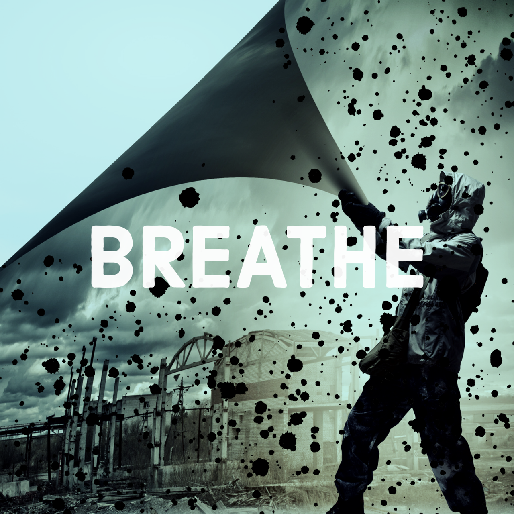

# Introduction

Air provides our most constant and intimate connection with the world around us. We swim in it, like fish in water, our lungs never ceasing their rhythmic swell and relax, 12 to 20 times every minute of our lives. Like those fish filtering water across their gills, we also interact with whatever is in that half-litre of air inspired with every breath. 

As a global society, we treat our shared air-ocean like an open sewer, filling it with gases, aerosols and particles. It seems that we pay less attention to this behaviour than we do to contamination of water and land which is perhaps more visible to us, because just slightly further removed. Perhaps we think air pollution will ‘blow away’ – wherever ‘away’ might be.

This project aims to investigate the air around us and our attitudes to it. Our starting point is measuring air-borne particulates at St James’s Piccadilly, in the heart of London. We have home-made sensors – an inspiring story in itself – installed in the church, the rectory, the garden and on the Piccadilly railings. We will analyse this data across the year, and use it as a jumping off point for reflections, liturgies, artwork and raising awareness.

Please check back here to see how we get on.

# The Project So Far

<ul>





    
        
        <li><a href="{{ p.url | prepend: site.baseurl }}">{{p.title}}
        </a></li>
        
    

</ul>

